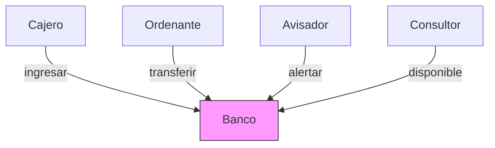

# 🏦 BLOCKCHAIN - Sistema Bancario Concurrente

Implementación de un sistema de gestión de cuentas bancarias con operaciones concurrentes usando dos enfoques diferentes:
1. **Monitores** (Práctica 1)
2. **JCSP** (Java Communicating Sequential Processes) (Práctica 2)

## 📋 Enunciado Original
El proyecto simula una entidad bancaria con cuatro tipos de procesos concurrentes:
- **Cajeros**: Realizan ingresos
- **Ordenantes**: Gestionan transferencias
- **Avisadores**: Monitorizan saldos mínimos
- **Consultores**: Consultan saldos periódicamente

## 📊 Diagrama de Arquitectura

## 🪛 Comparativa Técnica Detallada

| Aspecto               | Implementación con Monitor         | Implementación con JCSP         |
|-----------------------|------------------------------------|---------------------------------|
| **Paradigma**         | Memoria Compartida                 | Paso de Mensajes                |
| **Sincronización**    | `Monitor.enter()`/`leave()`        | Canales síncronos (`Channel`)   |
| **Espera condicional**| `Monitor.Cond.await()`/`signal()`  | `Alternative.select()`          |
| **Transferencias**    | Atómicas por bloqueo               | Atómicas por proceso dedicado   |
| **Alertas**           | Notificaciones explícitas          | Eventos por mensajes            |
| **Ordenación**        | FIFO con colas por cuenta          | Buffering en canales            |
| **Ventaja principal** | Control fino de exclusión          | Ausencia de deadlocks           |

## 📚 Aprendizajes Clave
### 1. Sincronización con Monitores
- **Control preciso** con `Monitor.Cond` para condiciones complejas
- **Importancia crítica** del orden de adquisición del mutex para evitar deadlocks
- **Eficiencia** usando `signal()` para planificar los desbloqueos
- **Patrón común**: Bloqueo jerárquico por ID de cuenta

### 2. Modelo CSP con JCSP
- **Ventajas** del aislamiento entre procesos (sin shared memory)
- **Multiplexación eficiente** con `Alternative` para múltiples canales
- **Overhead controlado**: Un proceso por tipo de operación
- **Sincronización implícita** mediante comunicación síncrona

### 3. Problemas Resueltos
- **Race conditions**: Eliminadas con secciones críticas bien delimitadas
- **Prioridad FIFO**: Implementada mediante colas por cuenta
- **Alertas eficientes**: Notificaciones solo cuando cambia el saldo relevante
- **Atomicidad**: Transferencias como operaciones indivisibles
  
## 🔍 Detalles Académicos
- Asignatura: Concurrencia (Grado en Ingeniería Informática)
- Universidad: Universidad Politécnica de Madrid
- Autor: Eduardo Gil Alba
